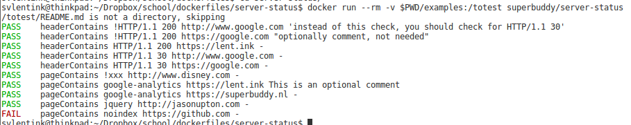

# Server status

This docker lets you test the status of your server.

## usage
You can use this to test your page(s) or the HEAD response of the server for the correct response (status).

## Your own tests
To see how you can configure this, please take a look at the examples.
Or just run it `docker run --rm -v $PWD/examples:/totest superbuddy/server-status`
